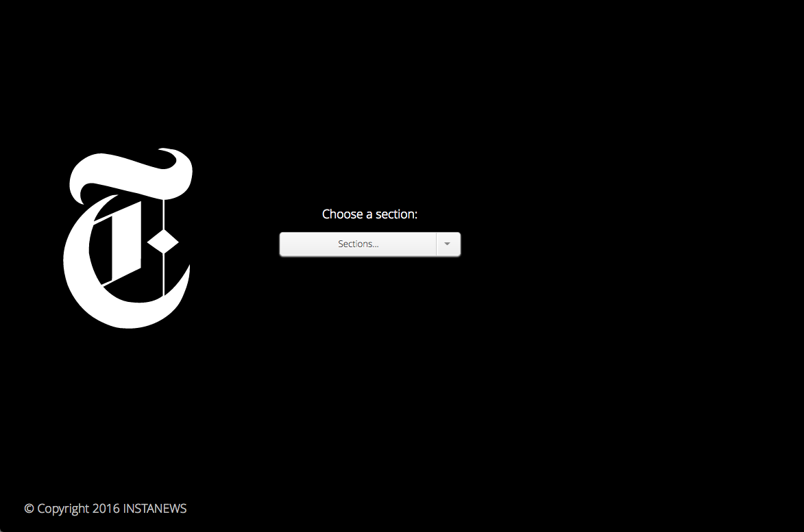

# Project 2: Instanews
This project is a web application that generates a visual grid of the most recent news stories from the New York Times.  It was designed as an introduction to using Ajax, JSON and APIs.

## Technologies Used:
This website has a main HTML page linked to minified CSS and JS files using Gulp.

- Ajax
- JSON
- [New York Times API](https://developer.nytimes.com/)
- SASS
- [Gulp](http://gulpjs.com/)
  - Dev dependencies:
    - browser-sync
    - gulp-autoprefixer
    - gulp-cssnano
    - gulp-eslint
    - gulp-prettyerror
    - gulp-rename
    - gulp-sass
    - gulp-uglify
- [Node](https://www.npmjs.com/)
- [Google Chrome](https://www.google.com/chrome/) 
- Google Chrome Developer Tools
- @font-face generated from [Font Squirrel](https://www.fontsquirrel.com/)
- JavaScript
- [jQuery](https://jquery.com/)
- HTML Validator (https://validator.w3.org/)
- CSS Validator (https://jigsaw.w3.org/css-validator/)
- CSS Reset, [Eric Meyer's Reset CSS](http://cssreset.com/scripts/eric-meyer-reset-css/)

## Personal Learnings
